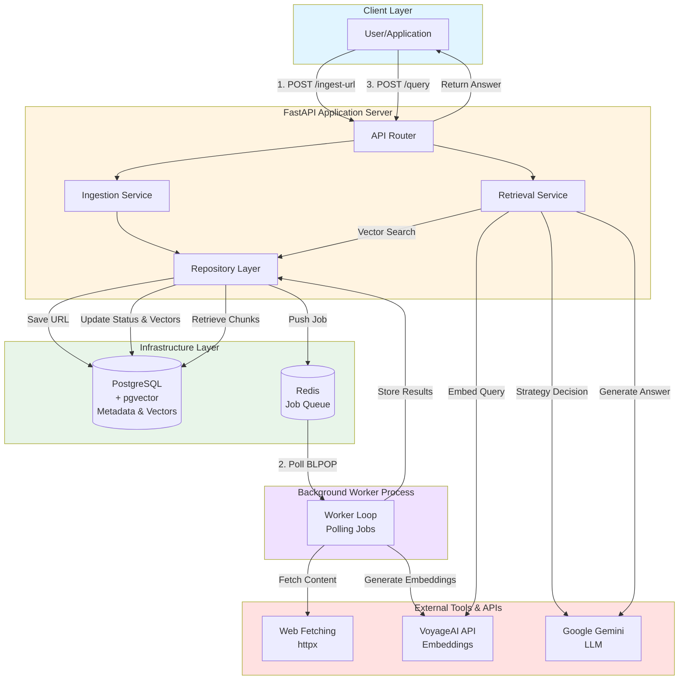
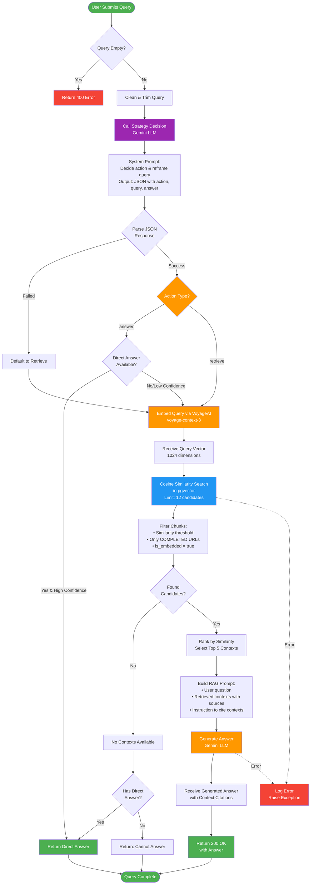

Web‑Aware RAG Engine
====================

Retrieval‑Augmented Generation (RAG) pipeline that ingests web pages, builds contextualized document embeddings, and serves semantic QA.


Overview
The system exposes two primary capabilities:
- URL ingestion: enqueue URLs, fetch HTML → clean text → sentence‑aware chunking → contextualized embeddings → persisted vectors.
- Question answering: embed query → vector search over chunks → assemble contexts → LLM answers with source awareness.


## Architecture and design choices


### System Design Diagram

High-level architecture showing the interaction between all components, infrastructure, and external services.



## RAG Ingestion Pipeline Flow

Detailed flow showing how URLs are processed from submission to embedded vectors in the database.

```mermaid
flowchart TD
    Start([User Submits URLs]) --> Validate{URLs Valid?}
    Validate -->|No| Error400[Return 400 Error]
    Validate -->|Yes| CheckDB{URL Already<br/>in Database?}
    
    CheckDB -->|No| CreateURL[Create New URL Record]
    CheckDB -->|Yes| CheckStatus{Status?}
    
    CreateURL --> SetPending[Set Status: PENDING]
    CheckStatus -->|COMPLETED| Skip[Skip Processing]
    CheckStatus -->|PENDING/FAILED| Requeue[Re-queue for Processing]
    
    SetPending --> EnqueueRedis[Push Job to Redis Queue]
    Requeue --> EnqueueRedis
    EnqueueRedis --> Return202[Return 202 Accepted]
    
    Return202 -.->|Async Processing| WorkerPoll[Worker Polls Redis Queue]
    
    WorkerPoll --> DequeueJob[Dequeue Job Message]
    DequeueJob --> StatusFetching[Update Status: FETCHING]
    
    StatusFetching --> FetchWeb[Fetch URL Content<br/>via httpx]
    FetchWeb --> CleanHTML[Clean HTML<br/>Remove scripts/styles/tags]
    CleanHTML --> ExtractText[Extract Plain Text<br/>Normalize whitespace]
    
    ExtractText --> StatusChunking[Update Status: CHUNKING]
    StatusChunking --> SplitSentences[Split by Sentence Boundaries]
    SplitSentences --> BuildChunks[Build Chunks<br/>Max 1200 chars<br/>Sentence-aware]
    
    BuildChunks --> SaveChunks[Save Chunks to Database]
    SaveChunks --> StatusEmbedding[Update Status: EMBEDDING]
    
    StatusEmbedding --> CallVoyage[Call VoyageAI API<br/>voyage-context-3<br/>Contextualized Embeddings]
    CallVoyage --> ReceiveVectors[Receive Embedding Vectors<br/>1024 dimensions]
    
    ReceiveVectors --> StoreVectors[Store Vectors in pgvector]
    StoreVectors --> MarkEmbedded[Mark Chunks as Embedded]
    
    MarkEmbedded --> StatusComplete[Update Status: COMPLETED]
    StatusComplete --> End([Ingestion Complete])
    
    FetchWeb -.->|Error| StatusFailed[Update Status: FAILED]
    CallVoyage -.->|Error| StatusFailed
    StatusFailed -.-> LogError[Log Error Details]

    style Start fill:#4CAF50,color:#fff
    style End fill:#4CAF50,color:#fff
    style Error400 fill:#f44336,color:#fff
    style StatusFailed fill:#f44336,color:#fff
    style SetPending fill:#2196F3,color:#fff
    style StatusFetching fill:#2196F3,color:#fff
    style StatusChunking fill:#2196F3,color:#fff
    style StatusEmbedding fill:#2196F3,color:#fff
    style StatusComplete fill:#4CAF50,color:#fff
    style CallVoyage fill:#FF9800,color:#fff
    style FetchWeb fill:#FF9800,color:#fff
```



## RAG Retrieval Pipeline Flow

Detailed flow showing query processing with strategy decision, vector search, and answer generation.




## Technology Choices & Justifications

### 1. Python 3.13

**Why Python:**
- Native async/await support: Built-in asyncio lets us handle non-blocking I/O for web fetching, database operations, and API calls. This maximizes throughput when dealing with multiple concurrent requests.
- Rich ecosystem: We get access to tons of libraries for web scraping (httpx, BeautifulSoup), ML operations (numpy, scipy), and modern web frameworks (FastAPI, Pydantic).
- Rapid development: Type hints combined with Pydantic models make development faster and catch bugs early. The syntax is straightforward and readable.
- Testing and tooling: The pytest framework is mature and reliable. Dependency management with uv or pip is well-established, and debugging tools are excellent.
- AI/ML integration: Most AI and LLM providers offer first-class Python SDKs. VoyageAI, Google, and OpenAI all have official Python libraries that work great.

### 2. FastAPI Framework

**Why FastAPI:**
- Async-first design: The framework is built around async/await, which is perfect for I/O-bound RAG operations that involve lots of waiting for databases and APIs.
- Automatic API documentation: You get interactive Swagger and ReDoc documentation out of the box without writing any extra documentation code.
- Type safety: Pydantic validation happens automatically on every request and response. This catches bad data early and gives users clear error messages.
- High performance: It's one of the fastest Python frameworks available, comparable to Node.js and Go in benchmarks. This is thanks to Starlette and uvicorn under the hood.
- Dependency injection: The DI system makes it easy to manage database connections, service instantiation, and configuration without cluttering your route handlers.

### 3. Chunking Strategy — Late Chunking

**Approach:**
This system uses a "late chunking" strategy where we extract and clean the full webpage content first, then chunk it right before embedding rather than during initial ingestion.

**Why this strategy:**
- Better semantic consistency: When you clean first, the text that gets embedded is already refined and contextually meaningful. No weird artifacts from HTML tags.
- Efficient re-embedding: If we switch embedding models down the road, we can re-chunk the content easily without having to fetch all the pages again from the internet.
- Less fragmentation: We avoid splitting sentences or paragraphs inappropriately because we can see the full structure before deciding where to split.
- Optimized for LLM retrieval: Late chunking means every chunk respects semantic boundaries through sentence-aware splitting. This gives better context during retrieval and leads to better answers.

### 4. Chunk Size — 1200 Characters

**Why this specific size:**
- Balance between context and performance: This size gives each chunk enough content to be meaningful (usually a few paragraphs) without hitting token limits or making the embeddings too sparse.
- Improves semantic search: Embedding models like VoyageAI work best when chunks are semantically coherent but not too long. 1200 characters typically captures 1-3 paragraphs of solid content.
- Efficient retrieval: The right chunk size makes retrieval faster since we're comparing fewer tokens in vector similarity search while keeping enough context to be useful.
- Optimal memory usage: Really large chunks mean fewer but heavier vectors. Tiny chunks mean tons of lightweight ones. This balanced size optimizes both storage and search speed.

### 5. PostgreSQL for Metadata & Vector Storage

**Why PostgreSQL:**
- Handles large metadata efficiently: Postgres performs really well for storing URLs, content, chunks, and their relationships during both ingestion and retrieval.
- Strong relational consistency: Foreign keys and ACID guarantees maintain strict relationships between documents, chunks, and metadata. No weird data inconsistencies.
- Production-proven reliability: Postgres has been battle-tested for decades. There's tons of tooling, backup strategies, and operational expertise available.
- Transactional integrity: We can safely update status through the pipeline (PENDING → FETCHING → CHUNKING → EMBEDDING → COMPLETED) without worrying about race conditions.

**Why pgVector extension:**
- Single integrated system: Both metadata and vector data live in one PostgreSQL database. No need to sync between multiple databases or deal with complex data flows. Joins between metadata and embeddings are straightforward.
- Efficient similarity search: Cosine and Euclidean distance calculations happen directly inside PostgreSQL using native SQL queries and optimized C implementations.
- Scalable indexing: Advanced indexing strategies like IVFFlat and HNSW let us handle fast vector retrieval at scale, even with millions of embeddings.
- Cost-effective: We avoid deploying a separate vector database like Pinecone or Qdrant. Simpler architecture, lightweight Docker setup. Just one database to manage, backup, and monitor.
- Rich querying: We can combine vector similarity search with regular filters (status, timestamps, URL patterns) in a single SQL query. Really powerful for complex searches.
- 1024-dimensional vectors: Native support for high-dimensional vectors matches VoyageAI's embedding output dimensions perfectly.

### 6. Redis for Job Queue

**Why Redis as a queue:**
- Simple and reliable: Using list-based queues with LPUSH and BLPOP gives us atomic enqueue/dequeue without needing a complex message broker setup.
- Low latency: Redis is in-memory, so queue operations take less than a millisecond. This keeps the API responsive.
- Blocking operations: BLPOP lets workers efficiently wait for jobs without busy-waiting or burning CPU cycles. Workers just sleep until a job arrives.
- Lightweight deployment: A single Redis instance via Docker is enough for most workloads. No need to spin up Kafka, RabbitMQ, or cloud-managed queues initially.
- Durability options: You can configure persistence (RDB snapshots, AOF logs) to balance performance with job loss protection if Redis crashes.
- Decouples API from workers: The API can respond immediately with 202 Accepted while background workers process jobs at their own pace. Clean separation of concerns.

### 7. VoyageAI Embeddings

**Why VoyageAI voyage-context-3:**
- Contextualized embeddings: Unlike standard embedding models, voyage-context-3 generates embeddings that preserve document structure and relationships between chunks. This leads to more accurate retrieval.
- 1024 dimensions: Good balance. Rich enough for semantic representation but not so large that storage and computation become expensive (compared to 1536 or 3072 dimension models).
- Optimized for retrieval: This model is purpose-built for semantic search and RAG applications. It consistently outperforms general-purpose models like OpenAI's text-embedding-ada-002 on retrieval benchmarks.
- Fast API response: Embedding generation typically takes less than a second for normal chunks. This means real-time query processing without noticeable lag.
- Batch processing: The API supports batch embedding requests, so we can efficiently process multiple chunks at once during ingestion.
- Semantic understanding: Deep contextual awareness means similar concepts cluster together even with different wording (like "ML" and "machine learning").

### 8. Google Gemini 2.5 Pro

**Why Gemini for LLM generation:**
- Advanced reasoning: Gemini 2.5 Pro is really good at multi-step reasoning, context synthesis, and generating accurate answers from retrieved passages.
- Large context window: Supports up to 1M tokens, way beyond GPT-4's limits. We can feed it multiple retrieved contexts plus extensive conversation history without truncation.
- Grounded generation: Strong instruction-following keeps the model focused on the provided contexts and ensures it cites sources properly. Less hallucination.
- Cost-effective: Competitive pricing compared to GPT-4, especially important for high-volume RAG workloads with lots of queries per minute.
- Low latency: Fast response times, typically 1-3 seconds for RAG answers. Good enough for interactive applications.
- Native Python SDK: The official google-genai library has clean async/await integration, streaming support, and solid error handling.
- JSON mode: Structured output support makes parsing strategy decisions (action type, reframed query) reliable without brittle regex or prompt engineering hacks.

### 9. Async Python Worker

**Why custom async worker over Celery/RQ:**
- Simplicity: Single Python file with explicit async control flow. No hidden magic, easier debugging, and lower cognitive overhead compared to Celery's complex task routing system.
- Async native: Built on asyncio from the ground up. We get concurrent web fetching, database operations, and API calls without thread or process overhead.
- Lightweight: No additional dependencies like brokers, result backends, or beat schedulers. Redis BLPOP is enough for this workload's queueing needs.
- Easy deployment: Single process, no multiprocessing or distributed worker pools needed initially. We can scale vertically first, then horizontally by adding more worker instances.
- Full control: Direct access to error handling, retry logic, status updates, and logging without framework constraints or abstractions getting in the way.
- Fast startup: Minimal initialization time compared to Celery's worker startup. Great for development iteration and containerized deployments.

## Low Level Design

- Layered modules:
  - `app/api` for request DTOs, dependency wiring, and FastAPI routes (see `app/api/router.py:11`).
  - `app/service` for orchestration: ingestion (`app/service/ingestion_service.py`) and retrieval (`app/service/retrieval_service.py`).
  - `app/repository` as a persistence/queue adapter over PostgreSQL and Redis with clean entity conversion.
  - `pkg/` provides infrastructure clients: PostgreSQL, Redis, embedding, LLM, and configuration.
- Async I/O end‑to‑end: HTTP fetching, DB, Redis, and CPU‑bound steps delegated to threads where needed.
- Decoupled ingestion: API enqueues jobs to Redis; a separate worker performs fetch/chunk/embed, improving API latency and throughput.
- Guardrails in retrieval: domain diversity limits, similarity thresholds, and fallback selection to keep answers grounded.
- Strong typing: Pydantic request/response models and dataclasses for domain entities.


## Technology Stack
- Laguage: Python
- API Framework: FastAPI 
- Ingestion worker: Python Async Consumer
- Persistence: PostgreSQL 16 + pgvector extension
- Queue: Redis
- Embeddings: VoyageAI contextual embedding
- LLM: Gemini 2.5 Pro

## Database Schema

### Tables

**`urls`** — URL tracking and ingestion status
- `id UUID PK`, `url VARCHAR(2048) unique`, `status enum (PENDING/FETCHING/CHUNKING/EMBEDDING/COMPLETED/FAILED), timestamps`

**`contents`** — Full page content (before chunking)
- `id UUID PK`, `url_id FK → urls`, `content TEXT, timestamps`

**`chunks`** — Sentence-aware text segments
- `id UUID PK`, `url_id FK → urls (CASCADE, indexed)`, `content_id FK → contents`, `chunk_content TEXT`, `is_embedded BOOLEAN`, `timestamps`

**`embeddings`** — 1024-dim vectors from VoyageAI
- `id UUID PK`, `chunk_id FK → chunks `, `vector VECTOR (pgvector)`, `timestamps`

### Notes
- pgvector initialized on startup; 1024-dim vectors implicit in column type
- Similarity search uses cosine distance: `ORDER BY embedding <=> query_vector`
- TIMESTAMPTZ for timezone-aware timestamps across regions

## API Reference
Base URL: `http://localhost:8000`

Endpoints
- POST `/api/ingest-url`
  - Body: `{ "urls": ["https://example.com", "https://news.ycombinator.com"] }`
  - Returns: `202 Accepted` (empty body). URLs are persisted/queued; worker performs ingestion.
  - Errors: `400` if no URLs provided.

  Example
  ```bash
  curl -i -X POST http://localhost:8000/api/ingest-url \
    -H 'Content-Type: application/json' \
    -d '{"urls":["https://example.com","https://news.ycombinator.com"]}'
  ```

- POST `/api/query`
  - Body: `{ "query": "What did X announce?" }`
  - Returns: `200 OK` with `{ "answer": "..." }`. Answers are grounded in retrieved contexts.
  - Errors: `400` if empty query.

  Example
  ```bash
  curl -s -X POST http://localhost:8000/api/query \
    -H 'Content-Type: application/json' \
    -d '{"query":"What is the latest on ...?"}' | jq
  ```

OpenAPI UI
- Swagger UI: `http://localhost:8000/docs`
- ReDoc: `http://localhost:8000/redoc`

## Setup & Run
Prerequisites
- Python 3.13
- `uv` (for environment and runner)
- Docker (for Postgres/Redis via compose)

1) Install dependencies
- Using uv and `pyproject.toml`:
  - `uv sync`
- Or via `requirements.txt`:
  - `python -m venv .venv && source .venv/bin/activate`
  - `pip install -r requirements.txt`

2) Configure environment
- Copy `.env.example` to `.env` and fill values:
  - Required: `VOYAGE_API_KEY`, `POSTGRES_DB_*`, `REDIS_*`
  - Optional: `GEMINI_API_KEY` (required for LLM answers)

3) Start backing services (Docker)
- `docker compose up` (or `make docker-compose`)

4) Run the API server
- `uv run --env-file .env python cmd_server/server/main.py` (or `make run`)
- API listens on `http://localhost:8000`

5) Run the ingestion worker
- `uv run --env-file .env python cmd_server/worker/main.py` (or `make run-worker`)

Environment Variables (`.env`)
- See `pkg/config/config.py` for the full list and defaults. `.env.example` includes the common ones:
  - `VOYAGE_API_KEY` (required)
  - `GEMINI_API_KEY` (optional but required for answers)
  - `POSTGRES_DB_USER`, `POSTGRES_DB_PASSWORD`, `POSTGRES_DB_HOST`, `POSTGRES_DB_PORT`, `POSTGRES_DB_NAME`
  - `REDIS_HOST`, `REDIS_PORT`, `REDIS_DB` (default 0), `REDIS_QUEUE_NAME` (default `url_ingestion`)

Docker (Postgres/Redis)
- Compose file: `docker-compose.yaml`. It starts:
  - Postgres 16 with pgvector (`pgvector/pgvector:pg16`) exposed on `5432`.
  - Redis 7‑alpine exposed on `6379`.
- Default Postgres credentials in compose are placeholders; override with your `.env` when running the app.


